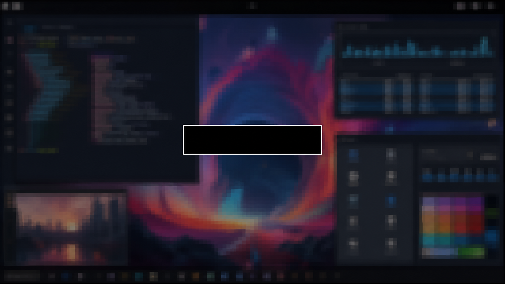

# AwesomeWM Screenlock Plugin

<p align="center">
  
</p>
    
`awesomewm-screenlock-plugin` implements a C + Lua native screenlock plugin
that takes the last visible desktop and turns it into a frozen, privacy-filtered
image used as the lock screen background. The image is captured and filtered
before the lock window is mapped, so the unfiltered desktop is never rendered
by the locker.

This repository exists for AwesomeWM users who want that experience without
putting the sensitive parts of locking inside the window manager's Lua process,
or the clumsy management of dependencies. shell scripts, and sub-shells invoked
by Lua. It combines a small Lua-facing API with a native helper that owns the
lock while it is active. That separation makes the implementation easier to
reason about: configuration stays pleasant to use from `rc.lua`, while screen
capture, input, and authentication stay behind a narrower native boundary.

If you want an X11 locker that is visually considerate, PAM-backed, and
deliberate about where passwords and display access go, this is a repository
worth considering. It is inspired by [`i3lock`](https://github.com/i3/i3lock),
but shaped natively for AwesomeWM's LuaJIT configuration model.

## Why use it?

A lock screen should feel like part of the desktop, not like a sudden crash to
black. This plugin keeps the session recognizable while making the content
hard to read, so locking feels deliberate without giving away what was on the
screen.

- Keep the desktop's visual context with a noisy, scaled, and pixelated snapshot
  instead of replacing it with a generic blank screen.
- Protect privacy by making the previous desktop difficult to inspect at a
  glance (the goal is privacy, not decoration).
- Get a flashing and dancing input feedback as the prompt alternates between
  black and white for every interaction (add/remove char).
- Fit naturally into AwesomeWM through a small Lua API and a single package.

The result is a faster-feeling, more considered lock screen inspired by
[`i3lock`](https://github.com/i3/i3lock), but designed to natively integrate and
implement AwesomeWM's workflow and LuaJIT configuration model.

## Requirements

- AwesomeWM 4.x
- Lua or LuaJIT with `awful.spawn`
- X11 with XCB
- PAM configured with an `xlock` service
- FFmpeg libraries with the `x11grab` input and video filters

## Usage

Install the Lua module and helper, then add this to `rc.lua`:

```lua
local screenlock = require("awesomewm_screenlock")()

awful.key({ modkey }, "Home", function()
    screenlock:lock()
end)
```

You can find an implementation reference at
[macunha1/aweswm](https://github.com/macunha1/aweswm/commit/51b19d8c4802cde4d5a3891ea2afbfd7bb20b2d4)
with its wiring in
[macunha1/configuration.nix](https://github.com/macunha1/configuration.nix/commit/d4383a4688df843c0d18efb6901f1cbd38f802b9)

Check the commits above to understand how that was implemented using Nix to
install the dependencies and then wire it into AwesomeWM's `rc.lua`.

## Build

```sh
meson setup build
meson compile -C build
meson test -C build
```

Nix users can build the package or development shell:

```sh
nix build
nix develop
```

The flake package contains both the helper binary and the Lua module, so a
configuration flake can expose one package to AwesomeWM:

```nix
inputs.awesomewm-screenlock-plugin.url =
  "github:macunha1/awesomewm-screenlock-plugin";

let
  screenlock = inputs.awesomewm-screenlock-plugin.packages.${pkgs.system}.default;
in
{
  environment.systemPackages = [ screenlock ];
  services.xserver.windowManager.awesome.luaModules = [ screenlock ];
}
```

## Design

### Details

The helper uses the `xlock` PAM service by default and reads
`AWESOMEWM_SCREENLOCK_PAM_SERVICE` when another service is required.

The helper starts a native capture worker, waits for its filtered frame, and
only then maps the lock surface. FFmpeg applies the privacy filter:

```text
noise=alls=10,scale=iw*.05:-1,scale=iw*20:-1:flags=neighbor
```

This gives every lock a dynamic image from the display that was actually in
use, while reducing readable content before the lock surface is shown. The
effect is practical rather than decorative: it preserves the context of the
session without leaving the previous desktop legible to someone looking over
your shoulder.

When Xinerama reports multiple active displays, the helper draws the same
prompt state at the center of every display. Password dots, foreground and
background colors, and the flashing state are shared, so the prompts remain
consistent while the lock surface still covers the complete X11 root window.

### Security concerns

Lua owns configuration and the helper process lifecycle. C owns the X11/XCB
capture and lock surface, FFmpeg filtering, keyboard input, and PAM
authentication. The password is held only in the native helper and never
crosses into Lua or the AwesomeWM process.

This is an X11 locker, not a general-purpose desktop security boundary. It is
designed to protect a screen from ordinary nearby observation and to keep user
passwords out of the window manager process. X11's trust model still applies: an
X11 client with equivalent authority can observe, inject input, or otherwise
interfere with any X11 locker. This plugin cannot provide Wayland security
guarantees, and it should not be presented as protection against a compromised
session, a hostile X11 client, or an attacker who already has equivalent access
to the display server.
